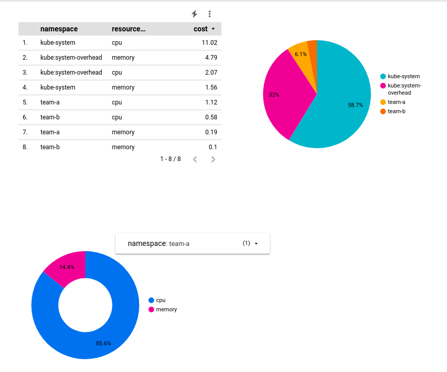
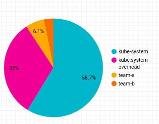

# gke-multi-tenant-app

Managing a GKE Multi-tenant Cluster with Namespaces

---



---

Below is a step-by-step implementation of this Lab project. To see the Terraform Implementation steps, go to [this link](./terraform/README.md)

---

## **Task 1 — Download the required files**

> **Before diving into the hands-on multi-tenant work, the very first step is to pull down the lab assets from the public Cloud Storage bucket and place yourself in the working directory. The two commands below do exactly that, and the short explanations will help you understand (and troubleshoot) what each flag does.**

| Command                                          | What it does                                                                                                                                                                                                                                                                                                   | Why it matters                                                                                                                                                |
| ------------------------------------------------ | -------------------------------------------------------------------------------------------------------------------------------------------------------------------------------------------------------------------------------------------------------------------------------------------------------------- | ------------------------------------------------------------------------------------------------------------------------------------------------------------- |
| `gsutil -m cp -r gs://spls/gsp766/gke-qwiklab ~` | `gsutil` is the Cloud Storage CLI. `-m` turns on multi-threaded transfers for faster copies, `cp` is “copy,” and `-r` means “recurse into every sub-folder.” The URI points at the **public Skills Boost bucket** that hosts the lab’s YAML manifests. The destination `~` is your Cloud Shell home directory. | Parallel copy is the quickest way to fetch an entire folder tree from a bucket, and the public `spls` bucket is readable by every Google Cloud account.       |
| `cd ~/gke-qwiklab`                               | Changes your current working directory into the freshly downloaded folder.                                                                                                                                                                                                                                     | Staying inside this directory keeps all subsequent `kubectl apply -f …` and shell scripts relative, avoiding long paths and accidental file-not-found errors. |

### Quick verification

```bash
ls -1 ~/gke-qwiklab
```

You should see a list of YAML manifests (for namespaces, quotas, RBAC, etc.) and helper scripts. If nothing appears, re-run the copy command or confirm Cloud Shell still has an active session.

### Behind the scenes

- **Why `gsutil`?** – Although Google now recommends `gcloud storage cp`, `gsutil` remains fully supported and has identical flags for recursive, parallel copying.
- **Public buckets** – The `spls` (Skills Boost) buckets are world-readable; no extra IAM steps are required.
- **Multi-threading (`-m`)** – Parallelism dramatically improves throughput when a bucket contains dozens of small files, as is typical for lab starter kits.

> ✅ **You’re ready for Task 2.** All YAML manifests and helper scripts are now on your Cloud Shell instance and you’re scoped to the correct directory, so the next `kubectl` or `gcloud` commands will reference local files without extra path juggling.

---

## **Task 2 — View and create namespaces**

> **Ensuring that every tenant works in its own **namespace** is the cornerstone of a cost-efficient, multi-tenant GKE setup. The steps below walk you through authenticating to the lab cluster, inspecting the four built-in system namespaces, creating two team namespaces, and verifying that identically named Pods can coexist when isolated by namespace. These commands slot straight into the playbook you began in Task 1 and prepare the ground for upcoming RBAC and quota work.**

### 1 Authenticate to the multi-tenant cluster

```bash
export ZONE=us-east1-b
gcloud config set compute/zone "${ZONE}"
gcloud container clusters get-credentials multi-tenant-cluster
```

_`get-credentials` adds the cluster’s endpoint and certificate to `$HOME/.kube/config`, so every `kubectl` command that follows is authenticated and points at the right control plane._

### 2 Inspect default Kubernetes namespaces

```bash
kubectl get namespace
```

You should see the **four system namespaces** that ship with every cluster:

| Namespace         | Purpose                                                                              |
| ----------------- | ------------------------------------------------------------------------------------ |
| `default`         | Where objects land when no namespace is specified.                                   |
| `kube-system`     | Hosts core control-plane add-ons such as DNS, metrics-server, logging.               |
| `kube-public`     | Read-only space designed for cluster-wide public resources (e.g., the root CA).      |
| `kube-node-lease` | Stores node heartbeat Lease objects so the controller can spot node failure quickly. |

### 3 Create tenant namespaces

```bash
kubectl create namespace team-a
kubectl create namespace team-b
```

_Never start a custom namespace with `kube-`; that prefix is reserved for system use._

Verify:

```bash
kubectl get namespace
```

### 4 Deploy identical Pods into each namespace

```bash
kubectl run app-server --image=centos --namespace=team-a -- sleep infinity
kubectl run app-server --image=centos --namespace=team-b -- sleep infinity
```

List every Pod in every namespace:

```bash
kubectl get pods -A
```

### 5 Inspect and narrow your kubectl context

```bash
kubectl describe pod app-server --namespace=team-a
kubectl config set-context --current --namespace=team-a
kubectl describe pod app-server   # now runs without --namespace
```

### 6 Why namespaces matter for cost & isolation

- **Quota boundaries** – ResourceQuota and LimitRange objects attach to a namespace, capping runaway CPU/RAM and guaranteeing fair-share usage.
- **Access controls** – RBAC rules bind identities to Roles _within_ a namespace, so each team sees only its own objects.
- **Network segmentation** – NetworkPolicy selectors use namespace and pod labels to permit or deny traffic, shutting down “noisy-neighbour” risks.
- **Billing clarity** – GKE Cost Allocation labels every object with its namespace, letting you attribute spend per team in BigQuery or Looker Studio.

---

## **Task 3 — Access Control in namespaces**

> **A minimal-privilege, namespace-scoped access model in GKE is built by pairing a lightweight IAM role that lets identities reach the cluster API with fine-grained Kubernetes RBAC objects that apply only inside a tenant’s namespace. The steps below translate the raw lab instructions into a reusable playbook, explain _why_ each command matters, and highlight best-practice guard-rails for multi-tenant security and cost control.**

### 1 Why IAM + RBAC are both required

- **IAM (Google Cloud)** operates at the project/cluster level; without it, a principal cannot even hit the Kubernetes API server.
- **RBAC (Kubernetes)** then scopes what that principal may actually do inside the cluster or namespace (create Pods, list Services, etc.). RBAC rules never override broader IAM rights, so keep IAM minimal and let RBAC carry the detail.

### 2 Grant the service account the _minimal_ IAM role

```bash
gcloud projects add-iam-policy-binding "${GOOGLE_CLOUD_PROJECT}" \
  --member="serviceAccount:team-a-dev@${GOOGLE_CLOUD_PROJECT}.iam.gserviceaccount.com" \
  --role="roles/container.clusterViewer"
```

Verify:

```bash
gcloud projects get-iam-policy "${GOOGLE_CLOUD_PROJECT}" --flatten="bindings[].members" \
  --filter="bindings.members:team-a-dev" --format="table(bindings.role)"
```

### 3 Create the tenant’s namespace-scoped Role

#### 3.1 Single-rule role (CLI one-liner)

```bash
kubectl create role pod-reader \
  --verb=get --verb=list --verb=watch \
  --resource=pods \
  --namespace=team-a
```

#### 3.2 Multi-rule role (YAML)

```yaml
# developer-role.yaml
apiVersion: rbac.authorization.k8s.io/v1
kind: Role
metadata:
  namespace: team-a
  name: developer
rules:
  - apiGroups: [""]
    resources: ["pods", "services", "serviceaccounts"]
    verbs: ["get", "watch", "list", "create", "update", "delete"]
  - apiGroups: ["apps"]
    resources: ["deployments"]
    verbs: ["get", "watch", "list", "create", "update", "delete"]
```

```bash
kubectl apply -f developer-role.yaml
```

### 4 Bind the Role to the service account

```bash
kubectl create rolebinding team-a-developers \
  --role=developer \
  --user="team-a-dev@${GOOGLE_CLOUD_PROJECT}.iam.gserviceaccount.com" \
  --namespace=team-a
```

### 5 Impersonate & test the permissions

```bash
gcloud iam service-accounts keys create /tmp/key.json \
  --iam-account=team-a-dev@${GOOGLE_CLOUD_PROJECT}.iam.gserviceaccount.com
gcloud auth activate-service-account --key-file=/tmp/key.json
export ZONE=us-east1-b
gcloud container clusters get-credentials multi-tenant-cluster --zone "$ZONE"
kubectl get pods -n team-a        # should list app-server
kubectl get pods -n team-b        # should be Forbidden
```

### 6 Good-practice guard-rails

| Control                                               | Why                                                                | How                                                                          |
| ----------------------------------------------------- | ------------------------------------------------------------------ | ---------------------------------------------------------------------------- |
| Separate Roles per tenant                             | Prevent privilege creep and simplify rotation.                     | Duplicate `developer-role.yaml`, change the namespace, keep verbs identical. |
| Avoid wild-card verbs/resources                       | Reduces blast radius if credentials leak.                          | Explicitly list verbs (`get,list,watch,create,update,delete`).               |
| Use Groups for humans, Service Accounts for workloads | Clear audit trail; easy off-boarding.                              | `--group=devs@example.com` in RoleBinding for SSO users.                     |
| Pair RBAC with NetworkPolicy                          | Prevent east-west traffic leaks.                                   | Default-deny + same-namespace allow rules.                                   |
| Apply ResourceQuota & LimitRange                      | Fair-share CPU/RAM, avoids OOM spikes that waste autoscaled nodes. | Define quota objects per namespace.                                          |
| Label everything (`cost-center=team-a`)               | Drives BigQuery cost-allocation joins for show-back.               | GKE auto-appends labels into billing export.                                 |

---

## **Task 4 — Resource quotas**

> **Resource quotas let you ring-fence each tenant’s share of cluster capacity, preventing “noisy neighbour” overruns while giving finance teams clean metrics for show-back. In GKE you pair a lightweight IAM + RBAC model (already set up in Task 3) with one `ResourceQuota` (and usually a matching `LimitRange`) per namespace.**

### 1 Set an Object-Count Quota (Pods + LB)

```bash
kubectl create quota test-quota \
  --hard=count/pods=2,count/services.loadbalancers=1 \
  --namespace=team-a
```

Verify:

```bash
kubectl describe quota test-quota -n team-a
```

### 2 Update the Pod limit to 6

```bash
export KUBE_EDITOR="nano"
kubectl edit quota test-quota --namespace=team-a   # change count/pods to "6"
```

### 3 Cap Aggregate CPU & Memory

```yaml
# cpu-mem-quota.yaml
apiVersion: v1
kind: ResourceQuota
metadata:
  name: cpu-mem-quota
  namespace: team-a
spec:
  hard:
    limits.cpu: "4"
    limits.memory: "12Gi"
    requests.cpu: "2"
    requests.memory: "8Gi"
```

```bash
kubectl apply -f cpu-mem-quota.yaml
```

### 4 Demonstrate the quota

```yaml
# cpu-mem-demo-pod.yaml
apiVersion: v1
kind: Pod
metadata:
  name: cpu-mem-demo
  namespace: team-a
spec:
  containers:
    - name: cpu-mem-demo-ctr
      image: nginx
      resources:
        requests: { cpu: "100m", memory: "128Mi" }
        limits: { cpu: "400m", memory: "512Mi" }
```

```bash
kubectl create -f cpu-mem-demo-pod.yaml --namespace=team-a
kubectl describe quota cpu-mem-quota --namespace=team-a
```

### 5 Monitoring & Alerting

| Tool                     | What to track                            |
| ------------------------ | ---------------------------------------- |
| `kubectl describe quota` | Ad-hoc Used vs Hard                      |
| kube-state-metrics       | `kube_resourcequota*` Prometheus metrics |
| GKE Cost Allocation      | Labels every object with its namespace   |
| Prometheus alert         | Trigger when `used / hard > 0.9`         |

---

## **Task 5 — Monitoring GKE & GKE Usage Metering**

> **A single GKE dashboard already tells you _who_ (namespace, workload) is burning _what_ (CPU, RAM, disk), but coupling it with GKE Usage Metering unlocks line-item cost attribution in BigQuery and Looker Studio.**

### 1 Explore the Built-in GKE Dashboard

```
Navigation menu ▶ Observability ▶ Monitoring ▶ Dashboards ▶ GKE
```

_Filter Namespaces → team-a to drill into a tenant._

### 2 Metrics Explorer – CPU by namespace

1. Metrics Explorer → Metric: _Kubernetes Container / CPU usage time_
2. Filter: `namespace_name != kube-system`
3. Aggregation: Sum **by `namespace_name`**

### 3 Enable Usage Metering

```bash
export ZONE=us-east1-b
gcloud container clusters update multi-tenant-cluster \
  --zone $ZONE \
  --resource-usage-bigquery-dataset cluster_dataset
```

### 4 Build the Cost-Breakdown Table

```bash
export BILLING_TABLE=${GOOGLE_CLOUD_PROJECT}.billing_dataset.gcp_billing_export_v1_xxxx
export DATASET=cluster_dataset
export TARGET=usage_metering_cost_breakdown
export START=2020-10-26
sed -e "s/\${fullGCPBillingExportTableID}/$BILLING_TABLE/" \
    -e "s/\${projectID}/$GOOGLE_CLOUD_PROJECT/" \
    -e "s/\${datasetID}/$DATASET/" \
    -e "s/\${startDate}/$START/" \
    ~/gke-qwiklab/usage_metering_query_template.sql > cost_breakdown.sql
bq query --use_legacy_sql=false \
  --destination_table=$DATASET.$TARGET \
  --schedule='every 24 hours' --replace=true \
  "$(cat cost_breakdown.sql)"
```

### 5 Visualise in Looker Studio

1. Looker Studio → **Create ▶ Data Source → BigQuery → Custom Query**
2. Query:

   ```sql
   SELECT * FROM `[PROJECT_ID].cluster_dataset.usage_metering_cost_breakdown`
   ```

3. **Create Report**, add a **table**:

   - Data Range Dimension → `usage_start_time`
   - Dimension → `namespace`
   - Metric → `cost`
   - Filters → exclude blank namespaces, include `type = "requests"`

4. Duplicate → change chart to **Pie** for cost-by-namespace.

   

5. Add a **Donut** chart, Dimension `resource_name`, Metric `cost`, same filters.
6. Add **Dropdown control** bound to the donut for namespace drill-down.
7. Share ▶ Download as PDF for exec review.

---

> **With these five tasks completed you now have:**
>
> - A single shared GKE cluster with namespace isolation
> - Least-privilege IAM + RBAC for each tenant
> - Hard CPU/Mem & object quotas per namespace
> - Real-time Monitoring dashboards and alerts
> - BigQuery + Looker Studio cost reports broken down by namespace and resource type
